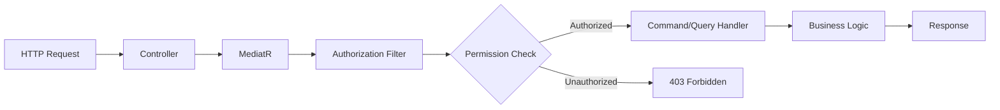

# 🛡️ Permissions & Authorization in QCLI

QCLI generates a comprehensive permission-based authorization system following enterprise security patterns. This documentation covers how permissions are structured, generated, and implemented across the application layers.

## Table of Contents
- [🏛️ Permission Architecture](#️-permission-architecture)
- [🔧 Permission Generation](#-permission-generation)
- [📁 File Structure](#-file-structure)
- [🎯 Permission Patterns](#-permission-patterns)
- [⚙️ Implementation Details](#️-implementation-details)
- [🚀 Usage Examples](#-usage-examples)
- [🔒 Authorization Flow](#-authorization-flow)
- [📝 Integration Guide](#-integration-guide)
- [🛠️ Customization](#️-customization)
- [📊 Best Practices](#-best-practices)
- [🧪 Testing Permissions](#-testing-permissions)
- [🔍 Troubleshooting](#-troubleshooting)

---

## 🏛️ Permission Architecture

### Core Concepts

QCLI implements a **hierarchical permission system** with the following structure:

```
Permissions
├── {Entity}
│   └── Actions
│       ├── View
│       ├── Profile
│       ├── Create
│       ├── Update
│       └── Delete
```

### Permission Naming Convention

All permissions follow a consistent naming pattern:
```
"Permissions:{EntityPlural}:{Action}"
```

**Examples:**
- `"Permissions:Products:View"`
- `"Permissions:Orders:Create"`
- `"Permissions:Customers:Update"`
- `"Permissions:Users:Delete"`

---

## 🔧 Permission Generation

### Automatic Generation

When you generate CRUD operations with QCLI, permissions are automatically created:

```bash
# Generates permissions automatically (default behavior)
qcli add Product --all

# Skip permission generation
qcli add Product --all --no-permissions
```

### Generated Permission File

For a `Product` entity, QCLI generates `ProductsPermissions.cs`:

```csharp
namespace Domain.PermissionsConstants;

public static partial class Permissions
{
    public static class Products
    {
        public static class Actions
        {
            public const string View = "Permissions:Products:View";
            public const string Profile = "Permissions:Products:Profile";
            public const string Create = "Permissions:Products:Create";
            public const string Update = "Permissions:Products:Update";
            public const string Delete = "Permissions:Products:Delete";
        }
    }
}
```

### Permission Actions Explained

| Action | Purpose | When Applied |
|--------|---------|-------------|
| **View** | Read access to entity lists | Applied to queries and list endpoints |
| **Profile** | Detailed view of specific entity | Applied to get-by-id operations |
| **Create** | Permission to create new entities | Applied to create commands |
| **Update** | Permission to modify existing entities | Applied to update commands |
| **Delete** | Permission to remove entities | Applied to delete commands |

---

## 📁 File Structure

### Permission Constants Location
```
src/
└── Core/
    └── Domain/
        └── PermissionsConstants/
            ├── ProductsPermissions.cs
            ├── OrdersPermissions.cs
            ├── CustomersPermissions.cs
            └── ... (other entities)
```

### Integration with Application Layer
```
src/
└── Core/
    └── Application/
        └── Products/
            ├── Commands/
            │   ├── CreateProduct/
            │   │   └── CreateProductCommand.cs    // [Authorize(Permissions = [Permissions.Products.Actions.Create])]
            │   ├── UpdateProduct/
            │   │   └── UpdateProductCommand.cs    // [Authorize(Permissions = [Permissions.Products.Actions.Update])]
            │   └── DeleteProduct/
            │       └── DeleteProductCommand.cs    // [Authorize(Permissions = [Permissions.Products.Actions.Delete])]
            └── Queries/
                ├── GetProducts/
                │   └── GetProductsQuery.cs         // [Authorize(Permissions = [Permissions.Products.Actions.View])]
                └── GetProductDetails/
                    └── GetProductDetailsQuery.cs   // [Authorize(Permissions = [Permissions.Products.Actions.Profile])]
```

---

## 🎯 Permission Patterns

### 1. Command Authorization

All generated commands include authorization attributes:

```csharp
using Application.Security;
using Domain.PermissionsConstants;

[Authorize(Permissions = [Permissions.Products.Actions.Create])]
public sealed class CreateProductCommand(ProductForCreateUpdateDto productDto) : IRequest<Guid>
{
    public ProductForCreateUpdateDto ProductDto { get; } = productDto;

    public sealed class Handler(IApplicationDbContext dbContext) 
        : IRequestHandler<CreateProductCommand, Guid>
    {
        public async Task<Guid> Handle(CreateProductCommand request, CancellationToken cancellationToken)
        {
            var product = new Product(Guid.NewGuid(), request.ProductDto.Name);
            dbContext.Products.Add(product);
            await dbContext.SaveChangesAsync(cancellationToken);
            return product.Id;
        }
    }
}
```

### 2. Query Authorization

Queries are secured with appropriate permissions:

```csharp
[Authorize(Permissions = [Permissions.Products.Actions.View])]
public sealed class GetProductsQuery(PaginatedRequestDto requestDto) 
    : IRequest<PaginatedList<ProductForListDto>>
{
    public PaginatedRequestDto RequestDto { get; } = requestDto;

    public sealed class Handler(IApplicationDbContext dbContext) 
        : IRequestHandler<GetProductsQuery, PaginatedList<ProductForListDto>>
    {
        public async Task<PaginatedList<ProductForListDto>> Handle(
            GetProductsQuery request, 
            CancellationToken cancellationToken)
        {
            var query = dbContext.Products
                .AsNoTracking()
                .Where(p => !p.IsDeleted); // Soft delete filter if FullyAudited

            return await query
                .Select(p => new ProductForListDto
                {
                    Id = p.Id,
                    Name = p.Name,
                    CreatedAt = p.CreatedAt
                })
                .ToPaginatedListAsync(request.RequestDto, cancellationToken);
        }
    }
}
```

### 3. Partial Class Structure

The `partial` keyword allows multiple entities to contribute to the same `Permissions` class:

```csharp
// ProductsPermissions.cs
public static partial class Permissions
{
    public static class Products { ... }
}

// OrdersPermissions.cs  
public static partial class Permissions
{
    public static class Orders { ... }
}

// Combined result:
public static partial class Permissions
{
    public static class Products { ... }
    public static class Orders { ... }
}
```

---

## ⚙️ Implementation Details

### Authorization Attribute

QCLI uses a custom `AuthorizeAttribute` from the `Application.Security` namespace:

```csharp
using Application.Security;

[Authorize(Permissions = [Permissions.Products.Actions.Create])]
public sealed class CreateProductCommand : IRequest<Guid>
{
    // Command implementation
}
```

### Permission Array Syntax

Modern C# collection expression syntax is used:

```csharp
// ✅ Modern syntax (C# 12+)
[Authorize(Permissions = [Permissions.Products.Actions.Create])]

// ❌ Legacy syntax (avoid)
[Authorize(Permissions = new[] { Permissions.Products.Actions.Create })]
```

### Multiple Permissions

For operations requiring multiple permissions:

```csharp
[Authorize(Permissions = [
    Permissions.Products.Actions.View,
    Permissions.Categories.Actions.View
])]
public sealed class GetProductsWithCategoriesQuery : IRequest<ProductCategoryDto>
{
    // Query implementation
}
```

---

## 🚀 Usage Examples

### E-commerce Application

```bash
# Product catalog
qcli add Product --all --entity-type Audited
qcli add Category --all --entity-type Audited

# Order management
qcli add Order --all --entity-type FullyAudited
qcli add OrderItem --all --entity-type Audited

# Customer management
qcli add Customer --all --entity-type FullyAudited
```

**Generated Permissions Structure:**

```csharp
public static partial class Permissions
{
    public static class Products
    {
        public static class Actions
        {
            public const string View = "Permissions:Products:View";
            public const string Profile = "Permissions:Products:Profile";
            public const string Create = "Permissions:Products:Create";
            public const string Update = "Permissions:Products:Update";
            public const string Delete = "Permissions:Products:Delete";
        }
    }

    public static class Orders
    {
        public static class Actions
        {
            public const string View = "Permissions:Orders:View";
            public const string Profile = "Permissions:Orders:Profile";
            public const string Create = "Permissions:Orders:Create";
            public const string Update = "Permissions:Orders:Update";
            public const string Delete = "Permissions:Orders:Delete";
        }
    }

    public static class Customers
    {
        public static class Actions
        {
            public const string View = "Permissions:Customers:View";
            public const string Profile = "Permissions:Customers:Profile";
            public const string Create = "Permissions:Customers:Create";
            public const string Update = "Permissions:Customers:Update";
            public const string Delete = "Permissions:Customers:Delete";
        }
    }
}
```

### CRM System

```bash
# Contact management
qcli add Contact --all --entity-type FullyAudited
qcli add Company --all --entity-type FullyAudited

# Sales pipeline
qcli add Lead --all --entity-type Audited
qcli add Opportunity --all --entity-type Audited
```

---

## 🔒 Authorization Flow

### 1. Request Processing



### 2. Permission Evaluation

The authorization system evaluates permissions in this order:

1. **Extract User Claims** - Get user permissions from JWT/Identity
2. **Parse Required Permissions** - Extract from `[Authorize]` attribute
3. **Permission Matching** - Check if user has required permissions
4. **Access Decision** - Allow or deny request

### 3. Integration with ASP.NET Core

```csharp
// In your authorization handler
public class PermissionAuthorizationHandler : AuthorizationHandler<PermissionRequirement>
{
    protected override Task HandleRequirementAsync(
        AuthorizationHandlerContext context,
        PermissionRequirement requirement)
    {
        var userPermissions = context.User.Claims
            .Where(c => c.Type == "permission")
            .Select(c => c.Value)
            .ToHashSet();

        if (requirement.Permissions.All(p => userPermissions.Contains(p)))
        {
            context.Succeed(requirement);
        }

        return Task.CompletedTask;
    }
}
```

---

## 📝 Integration Guide

### 1. Register Permissions in Provider

Create a permissions provider to register all permissions:

```csharp
// In PermissionsProvider.cs
public static class PermissionsProvider
{
    public static readonly string[] AllPermissions = {
        // Product permissions
        Permissions.Products.Actions.View,
        Permissions.Products.Actions.Profile,
        Permissions.Products.Actions.Create,
        Permissions.Products.Actions.Update,
        Permissions.Products.Actions.Delete,

        // Order permissions
        Permissions.Orders.Actions.View,
        Permissions.Orders.Actions.Profile,
        Permissions.Orders.Actions.Create,
        Permissions.Orders.Actions.Update,
        Permissions.Orders.Actions.Delete,

        // Add other entity permissions...
    };

    public static Dictionary<string, string[]> GetPermissionsByModule()
    {
        return new Dictionary<string, string[]>
        {
            ["Products"] = new[]
            {
                Permissions.Products.Actions.View,
                Permissions.Products.Actions.Profile,
                Permissions.Products.Actions.Create,
                Permissions.Products.Actions.Update,
                Permissions.Products.Actions.Delete
            },
            ["Orders"] = new[]
            {
                Permissions.Orders.Actions.View,
                Permissions.Orders.Actions.Profile,
                Permissions.Orders.Actions.Create,
                Permissions.Orders.Actions.Update,
                Permissions.Orders.Actions.Delete
            }
        };
    }
}
```

### 2. Configure Authorization

In your `Program.cs` or `Startup.cs`:

```csharp
// Register authorization services
builder.Services.AddAuthorization(options =>
{
    foreach (var permission in PermissionsProvider.AllPermissions)
    {
        options.AddPolicy(permission, policy =>
            policy.Requirements.Add(new PermissionRequirement(permission)));
    }
});

builder.Services.AddScoped<IAuthorizationHandler, PermissionAuthorizationHandler>();
```

### 3. Database Seeding

Seed permissions in your database:

```csharp
public static class PermissionSeeder
{
    public static async Task SeedPermissions(IServiceProvider serviceProvider)
    {
        using var scope = serviceProvider.CreateScope();
        var context = scope.ServiceProvider.GetRequiredService<ApplicationDbContext>();

        var existingPermissions = await context.Permissions
            .Select(p => p.Name)
            .ToHashSetAsync();

        var newPermissions = PermissionsProvider.AllPermissions
            .Where(p => !existingPermissions.Contains(p))
            .Select(p => new Permission { Name = p, Description = GetPermissionDescription(p) });

        if (newPermissions.Any())
        {
            context.Permissions.AddRange(newPermissions);
            await context.SaveChangesAsync();
        }
    }

    private static string GetPermissionDescription(string permission)
    {
        // Parse permission string to create human-readable description
        var parts = permission.Split(':');
        if (parts.Length == 3)
        {
            var entity = parts[1];
            var action = parts[2];
            return $"{action} {entity}";
        }
        return permission;
    }
}
```

---

## 🛠️ Customization

### Adding Custom Actions

You can extend the generated permissions with custom actions:

```csharp
public static partial class Permissions
{
    public static class Products
    {
        public static class Actions
        {
            // Generated permissions
            public const string View = "Permissions:Products:View";
            public const string Profile = "Permissions:Products:Profile";
            public const string Create = "Permissions:Products:Create";
            public const string Update = "Permissions:Products:Update";
            public const string Delete = "Permissions:Products:Delete";
            
            // Custom permissions
            public const string Export = "Permissions:Products:Export";
            public const string Import = "Permissions:Products:Import";
            public const string Approve = "Permissions:Products:Approve";
            public const string Publish = "Permissions:Products:Publish";
        }
    }
}
```

### Custom Permission Structure

For complex scenarios, you can create additional permission hierarchies:

```csharp
public static partial class Permissions
{
    public static class Products
    {
        public static class Actions
        {
            public const string View = "Permissions:Products:View";
            public const string Create = "Permissions:Products:Create";
            public const string Update = "Permissions:Products:Update";
            public const string Delete = "Permissions:Products:Delete";
        }

        public static class Advanced
        {
            public const string BulkEdit = "Permissions:Products:Advanced:BulkEdit";
            public const string PriceChange = "Permissions:Products:Advanced:PriceChange";
            public const string CategoryChange = "Permissions:Products:Advanced:CategoryChange";
        }

        public static class Reports
        {
            public const string SalesReport = "Permissions:Products:Reports:Sales";
            public const string InventoryReport = "Permissions:Products:Reports:Inventory";
            public const string PerformanceReport = "Permissions:Products:Reports:Performance";
        }
    }
}
```

### Conditional Permission Generation

You can control permission generation through configuration:

```json
{
  "codeGeneration": {
    "generatePermissions": true,
    "permissionActions": ["View", "Create", "Update", "Delete"],
    "customActions": ["Export", "Import"]
  }
}
```

---

## 📊 Best Practices

### 1. Permission Granularity

- **Balance granularity** - Not too broad, not too specific
- **Follow business boundaries** - Align with business operations
- **Consider user roles** - Design for typical role-based access

### 2. Naming Conventions

```csharp
// ✅ Good: Clear, consistent naming
Permissions.Products.Actions.Create
Permissions.Orders.Actions.View
Permissions.Customers.Actions.Update

// ❌ Avoid: Inconsistent or unclear naming
Permissions.Product.Add
Permissions.OrderView
Permissions.CustomerEdit
```

### 3. Permission Grouping

Group related permissions logically:

```csharp
public static class Permissions
{
    // Core business entities
    public static class Products { ... }
    public static class Orders { ... }
    public static class Customers { ... }

    // System management
    public static class Users { ... }
    public static class Roles { ... }
    public static class Settings { ... }

    // Reporting
    public static class Reports { ... }
    public static class Analytics { ... }
}
```

### 4. Performance Considerations

- **Cache permissions** - Load user permissions once per request
- **Use efficient lookups** - HashSet for permission checking
- **Minimize database calls** - Cache permission definitions

```csharp
// ✅ Efficient permission checking
private static readonly HashSet<string> UserPermissions = new(userPermissionsList);

public bool HasPermission(string permission)
{
    return UserPermissions.Contains(permission);
}
```

### 5. Testing Strategy

```csharp
[Test]
public async Task CreateProduct_WithValidPermission_ShouldSucceed()
{
    // Arrange
    var user = CreateUserWithPermissions(Permissions.Products.Actions.Create);
    var command = new CreateProductCommand(new ProductForCreateUpdateDto());

    // Act & Assert
    await Should.NotThrowAsync(async () => 
        await mediator.Send(command));
}

[Test]
public async Task CreateProduct_WithoutPermission_ShouldThrowUnauthorized()
{
    // Arrange
    var user = CreateUserWithoutPermissions();
    var command = new CreateProductCommand(new ProductForCreateUpdateDto());

    // Act & Assert
    await Should.ThrowAsync<UnauthorizedAccessException>(async () => 
        await mediator.Send(command));
}
```

---

## 🧪 Testing Permissions

### Unit Testing Commands

```csharp
public class CreateProductCommandTests
{
    [Test]
    public async Task Handle_WithValidData_ShouldCreateProduct()
    {
        // Arrange
        var command = new CreateProductCommand(new ProductForCreateUpdateDto
        {
            Name = "Test Product"
        });

        var handler = new CreateProductCommand.Handler(mockDbContext.Object);

        // Act
        var result = await handler.Handle(command, CancellationToken.None);

        // Assert
        result.Should().NotBe(Guid.Empty);
        mockDbContext.Verify(x => x.SaveChangesAsync(It.IsAny<CancellationToken>()), Times.Once);
    }
}
```

### Integration Testing with Authorization

```csharp
public class ProductsControllerTests : IntegrationTestBase
{
    [Test]
    public async Task CreateProduct_WithPermission_ShouldReturn201()
    {
        // Arrange
        await AuthenticateAsync(Permissions.Products.Actions.Create);
        var request = new ProductForCreateUpdateDto { Name = "Test Product" };

        // Act
        var response = await Client.PostAsJsonAsync("/api/products", request);

        // Assert
        response.StatusCode.Should().Be(HttpStatusCode.Created);
    }

    [Test]
    public async Task CreateProduct_WithoutPermission_ShouldReturn403()
    {
        // Arrange
        await AuthenticateAsync(); // No permissions
        var request = new ProductForCreateUpdateDto { Name = "Test Product" };

        // Act
        var response = await Client.PostAsJsonAsync("/api/products", request);

        // Assert
        response.StatusCode.Should().Be(HttpStatusCode.Forbidden);
    }
}
```

### Permission Coverage Testing

```csharp
[Test]
public void AllCommands_ShouldHaveAuthorizationAttributes()
{
    // Arrange
    var commandTypes = Assembly.GetAssembly(typeof(CreateProductCommand))!
        .GetTypes()
        .Where(t => t.Name.EndsWith("Command") && !t.IsAbstract)
        .ToList();

    // Act & Assert
    foreach (var commandType in commandTypes)
    {
        var hasAuthorizeAttribute = commandType.GetCustomAttributes<AuthorizeAttribute>().Any();
        hasAuthorizeAttribute.Should().BeTrue($"{commandType.Name} should have [Authorize] attribute");
    }
}
```

---

## 🔍 Troubleshooting

### Common Issues

#### 1. Missing Permission Constants

**Error:**
```
The name 'Permissions' does not exist in the current context
```

**Solution:**
- Ensure permissions were generated: `qcli add Product --all` (without `--no-permissions`)
- Add using statement: `using Domain.PermissionsConstants;`
- Check file location: `src/Domain/PermissionsConstants/`

#### 2. Authorization Attribute Not Working

**Error:**
```
The type or namespace name 'Authorize' could not be found
```

**Solution:**
- Add using statement: `using Application.Security;`
- Ensure custom authorization infrastructure is implemented
- Check MediatR pipeline configuration

#### 3. 403 Forbidden on Valid Requests

**Symptoms:**
- User has permission in database
- Still getting 403 Forbidden

**Debugging Steps:**

```csharp
// Add logging to authorization handler
public class PermissionAuthorizationHandler : AuthorizationHandler<PermissionRequirement>
{
    private readonly ILogger<PermissionAuthorizationHandler> _logger;

    protected override Task HandleRequirementAsync(
        AuthorizationHandlerContext context,
        PermissionRequirement requirement)
    {
        var userPermissions = context.User.Claims
            .Where(c => c.Type == "permission")
            .Select(c => c.Value)
            .ToHashSet();

        _logger.LogInformation("User permissions: {Permissions}", string.Join(", ", userPermissions));
        _logger.LogInformation("Required permissions: {Required}", string.Join(", ", requirement.Permissions));

        if (requirement.Permissions.All(p => userPermissions.Contains(p)))
        {
            _logger.LogInformation("Authorization succeeded");
            context.Succeed(requirement);
        }
        else
        {
            _logger.LogWarning("Authorization failed - missing permissions");
        }

        return Task.CompletedTask;
    }
}
```

#### 4. Partial Class Conflicts

**Error:**
```
The partial modifier can only appear immediately before 'class', 'struct', 'interface', or 'void'
```

**Solution:**
- Ensure consistent namespace across partial class files
- Check that all files use `public static partial class Permissions`
- Verify no conflicting class definitions

### Debugging Tools

#### Permission Audit Endpoint

Create an endpoint to list user permissions:

```csharp
[ApiController]
[Route("api/[controller]")]
public class PermissionsController : ControllerBase
{
    [HttpGet("my-permissions")]
    public IActionResult GetMyPermissions()
    {
        var permissions = User.Claims
            .Where(c => c.Type == "permission")
            .Select(c => c.Value)
            .ToList();

        return Ok(new { Permissions = permissions });
    }

    [HttpGet("all-permissions")]
    public IActionResult GetAllPermissions()
    {
        return Ok(new { Permissions = PermissionsProvider.AllPermissions });
    }
}
```

#### Configuration Validation

```bash
# Check if permissions are enabled in configuration
qcli config show

# Validate project structure
qcli doctor
```

---

## Related Documentation

- [Clean Architecture Overview](./clean-architecture.md) - Overall architecture patterns
- [CQRS Implementation](./cqrs.md) - Command and Query patterns
- [Entity Types](./entity-types.md) - Entity inheritance and audit trails

---

**🔒 Security is not an afterthought - it's built into every generated component.**

*For more advanced authorization scenarios, consider implementing role-based permissions, hierarchical permissions, or attribute-based access control (ABAC) on top of this foundation.*
