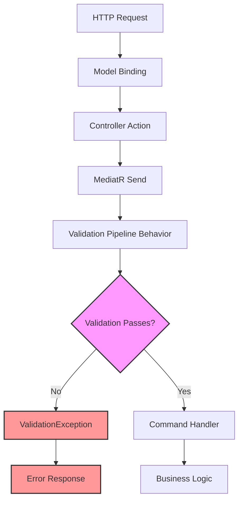

# 🔍 Validation & Error Handling in QCLI

This document explains the comprehensive validation system in QCLI-generated code, including FluentValidation integration, validation pipeline behavior, and error handling patterns.

---

## 📖 Table of Contents

1. [Overview](#-overview)
2. [FluentValidation Integration](#-fluentvalidation-integration)
3. [Validation Architecture](#-validation-architecture)
4. [Generated Validators](#-generated-validators)
5. [Validation Pipeline](#-validation-pipeline)
6. [Error Handling](#-error-handling)
7. [Custom Validation Rules](#-custom-validation-rules)
8. [Best Practices](#-best-practices)
9. [Testing Validation](#-testing-validation)
10. [Troubleshooting](#-troubleshooting)

---

## 🎯 Overview

QCLI generates a comprehensive validation system that ensures data integrity and provides meaningful error messages throughout the application. The validation system is built on FluentValidation and integrates seamlessly with MediatR's pipeline behavior.

### Key Features

- **FluentValidation Integration**: Type-safe, fluent validation rules
- **Multi-Layer Validation**: Command, DTO, and entity-level validation
- **Centralized Error Handling**: Consistent error responses across the application
- **Custom Base Classes**: `AppBaseAbstractValidator` with common patterns
- **Pipeline Integration**: Automatic validation through MediatR behaviors
- **Localization Support**: Customizable validation messages

---

## 🛠️ FluentValidation Integration

### AppBaseAbstractValidator Base Class

QCLI generates validators that inherit from `AppBaseAbstractValidator<T>`, which provides common validation patterns and utilities:

```csharp
using Application.Common;
using FluentValidation;

namespace Application.Products.Commands.CreateProduct;

public sealed class CreateProductCommandValidator : AppBaseAbstractValidator<CreateProductCommand>
{
    public CreateProductCommandValidator()
    {
        RuleFor(x => x.ProductDto).SetValidator(new ProductForCreateUpdateDtoValidator());
    }
}
```

### Common Validation Patterns

The base class includes pre-defined regex patterns and utilities:

```csharp
public abstract class AppBaseAbstractValidator<T> : AbstractValidator<T>
{
    // Common regex patterns
    protected static readonly Regex NameRegex = new(@"^[a-zA-Z\s]+$");
    protected static readonly Regex EmailRegex = new(@"^[^@\s]+@[^@\s]+\.[^@\s]+$");
    protected static readonly Regex PhoneRegex = new(@"^\+?[1-9]\d{1,14}$");
    
    // Common validation rules
    protected IRuleBuilderOptions<T, string> RequiredString<TProperty>(
        Expression<Func<T, TProperty>> expression) where TProperty : class
    {
        return RuleFor(expression)
            .NotEmpty()
            .WithMessage($"{GetPropertyName(expression)} is required.");
    }
}
```

---

## 🏗️ Validation Architecture

### Three-Layer Validation Strategy

QCLI implements validation at multiple layers to ensure comprehensive data integrity:

```
┌─────────────────────────────────────────────────────────────┐
│                    Controller Layer                         │
├─────────────────────────────────────────────────────────────┤
│  • Model Binding Validation                                │
│  • [ApiController] automatic validation                    │
└─────────────────────────────────────────────────────────────┘
                              │
                              ▼
┌─────────────────────────────────────────────────────────────┐
│                   Command/Query Layer                       │
├─────────────────────────────────────────────────────────────┤
│  • Command Validators (CreateProductCommandValidator)      │
│  • MediatR Pipeline Behavior Integration                   │
│  • Business Rule Validation                                │
└─────────────────────────────────────────────────────────────┘
                              │
                              ▼
┌─────────────────────────────────────────────────────────────┐
│                      DTO Layer                              │
├─────────────────────────────────────────────────────────────┤
│  • DTO Validators (ProductForCreateUpdateDtoValidator)     │
│  • Field-level validation rules                            │
│  • Complex property validation                             │
└─────────────────────────────────────────────────────────────┘
```

### Validation Flow Diagram



---

## 📝 Generated Validators

### Command Validators

Each CRUD command gets its own validator:

```csharp
// CreateProductCommandValidator.cs
using Application.Common;
using FluentValidation;

namespace Application.Products.Commands.CreateProduct;

public sealed class CreateProductCommandValidator : AppBaseAbstractValidator<CreateProductCommand>
{
    public CreateProductCommandValidator()
    {
        RuleFor(x => x.ProductDto).SetValidator(new ProductForCreateUpdateDtoValidator());
    }
}
```

```csharp
// UpdateProductCommandValidator.cs
using Application.Common;
using FluentValidation;

namespace Application.Products.Commands.UpdateProduct;

public sealed class UpdateProductCommandValidator : AppBaseAbstractValidator<UpdateProductCommand>
{
    public UpdateProductCommandValidator()
    {
        RuleFor(x => x.ProductId)
            .NotEmpty()
            .WithMessage("Product Id is required.");

        RuleFor(x => x.ProductDto).SetValidator(new ProductForCreateUpdateDtoValidator());
    }
}
```

```csharp
// DeleteProductCommandValidator.cs
using Application.Common;
using FluentValidation;

namespace Application.Products.Commands.DeleteProduct;

public sealed class DeleteProductCommandValidator : AppBaseAbstractValidator<DeleteProductCommand>
{
    public DeleteProductCommandValidator()
    {
        RuleFor(x => x.ProductId)
            .NotEmpty()
            .WithMessage("Product Id is required.");
    }
}
```

### DTO Validators

Comprehensive validation for Data Transfer Objects:

```csharp
// ProductForCreateUpdateDtoValidator.cs
using Application.Common;
using FluentValidation;

namespace Application.Products.Commands.CreateProduct;

public sealed class ProductForCreateUpdateDtoValidator : AppBaseAbstractValidator<ProductForCreateUpdateDto>
{
    public ProductForCreateUpdateDtoValidator()
    {
        RuleFor(x => x.Name)
            .NotEmpty()
            .WithMessage("Name is required.")
            .Matches(NameRegex)
            .WithMessage("Name must contain only alphabetic characters.")
            .MaximumLength(64)
            .WithMessage("Name cannot exceed 64 characters.");

        // Extended validation rules for complex properties
        RuleFor(x => x.Price)
            .GreaterThan(0)
            .WithMessage("Price must be greater than zero.")
            .LessThanOrEqualTo(999999.99m)
            .WithMessage("Price cannot exceed $999,999.99.");

        RuleFor(x => x.Category)
            .NotEmpty()
            .WithMessage("Category is required.")
            .MaximumLength(50)
            .WithMessage("Category cannot exceed 50 characters.");

        // Complex object validation
        RuleFor(x => x.Email)
            .SetValidator(new EmailValidator())
            .When(x => x.Email != null);

        // Collection validation
        RuleForEach(x => x.Tags)
            .NotEmpty()
            .WithMessage("Tag cannot be empty.")
            .MaximumLength(20)
            .WithMessage("Tag cannot exceed 20 characters.");
    }
}
```

### Advanced Validation Examples

```csharp
public sealed class ProductForCreateUpdateDtoValidator : AppBaseAbstractValidator<ProductForCreateUpdateDto>
{
    public ProductForCreateUpdateDtoValidator()
    {
        // Email validation with custom regex
        RuleFor(x => x.Email.Primary)
            .NotEmpty()
            .WithMessage("Primary Email cannot be empty.")
            .EmailAddress()
            .WithMessage("Primary Email is not valid.")
            .MaximumLength(64)
            .WithMessage("Primary Email cannot exceed 64 characters.");

        // Enum validation
        RuleFor(x => x.PreferredCurrency)
            .IsInEnum()
            .WithMessage("Preferred Currency is not valid.");

        // Conditional validation
        RuleFor(x => x.VatNumber)
            .NotEmpty()
            .When(x => x.IsBusinessCustomer)
            .WithMessage("VAT number is required for business customers.");

        // Custom validation rules
        RuleFor(x => x.Sku)
            .Must(BeUniqueSkuFormat)
            .WithMessage("SKU must follow the format: ABC-123-XYZ");

        // Cross-field validation
        RuleFor(x => x.EndDate)
            .GreaterThan(x => x.StartDate)
            .WithMessage("End date must be after start date.");

        // Nested object validation
        RuleFor(x => x.Address)
            .SetValidator(new AddressValidator())
            .When(x => x.Address != null);

        // Collection validation with complex rules
        RuleFor(x => x.OrderItems)
            .NotEmpty()
            .WithMessage("At least one order item is required.")
            .Must(items => items.Sum(x => x.Quantity) > 0)
            .WithMessage("Total quantity must be greater than zero.");
    }

    private bool BeUniqueSkuFormat(string sku)
    {
        var skuPattern = @"^[A-Z]{3}-\d{3}-[A-Z]{3}$";
        return Regex.IsMatch(sku, skuPattern);
    }
}
```

---

## 🔄 Validation Pipeline

### MediatR Pipeline Behavior

QCLI integrates with MediatR's pipeline behavior for automatic validation:

```csharp
public sealed class ValidationPipelineBehavior<TRequest, TResponse> : IPipelineBehavior<TRequest, TResponse>
    where TRequest : IRequest<TResponse>
{
    private readonly IEnumerable<IValidator<TRequest>> _validators;

    public ValidationPipelineBehavior(IEnumerable<IValidator<TRequest>> validators)
    {
        _validators = validators;
    }

    public async Task<TResponse> Handle(TRequest request, RequestHandlerDelegate<TResponse> next, CancellationToken cancellationToken)
    {
        if (_validators.Any())
        {
            var context = new ValidationContext<TRequest>(request);
            var validationResults = await Task.WhenAll(_validators.Select(v => v.ValidateAsync(context, cancellationToken)));
            var failures = validationResults.SelectMany(r => r.Errors).Where(f => f != null).ToList();

            if (failures.Any())
                throw new ValidationException(failures);
        }

        return await next();
    }
}
```

### Registration in DI Container

```csharp
// Program.cs or ServiceCollectionExtensions.cs
services.AddScoped(typeof(IPipelineBehavior<,>), typeof(ValidationPipelineBehavior<,>));
services.AddValidatorsFromAssembly(typeof(Application.AssemblyReference).Assembly);
```

---

## ❌ Error Handling

### Validation Exception

QCLI generates a comprehensive validation exception system:

```csharp
public sealed class ValidationException : Exception
{
    public IDictionary<string, string[]> Errors { get; }

    public ValidationException() : base("One or more validation failures have occurred.")
    {
        Errors = new Dictionary<string, string[]>();
    }

    public ValidationException(IEnumerable<ValidationFailure> failures) : this()
    {
        Errors = failures
            .GroupBy(e => e.PropertyName, e => e.ErrorMessage)
            .ToDictionary(failureGroup => failureGroup.Key, failureGroup => failureGroup.ToArray());
    }
}
```

### Global Exception Handler

```csharp
public sealed class GlobalExceptionHandler : IExceptionHandler
{
    public async ValueTask<bool> TryHandleAsync(
        HttpContext httpContext,
        Exception exception,
        CancellationToken cancellationToken)
    {
        var response = exception switch
        {
            ValidationException validationException => new
            {
                Type = "https://tools.ietf.org/html/rfc7231#section-6.5.1",
                Title = "Validation Error",
                Status = StatusCodes.Status400BadRequest,
                Detail = "One or more validation errors occurred.",
                Errors = validationException.Errors
            },
            NotFoundException notFoundException => new
            {
                Type = "https://tools.ietf.org/html/rfc7231#section-6.5.4",
                Title = "Resource Not Found",
                Status = StatusCodes.Status404NotFound,
                Detail = notFoundException.Message
            },
            _ => new
            {
                Type = "https://tools.ietf.org/html/rfc7231#section-6.6.1",
                Title = "Internal Server Error",
                Status = StatusCodes.Status500InternalServerError,
                Detail = "An unexpected error occurred."
            }
        };

        httpContext.Response.StatusCode = response.Status;
        await httpContext.Response.WriteAsJsonAsync(response, cancellationToken);
        return true;
    }
}
```

### API Error Response Format

```json
{
  "type": "https://tools.ietf.org/html/rfc7231#section-6.5.1",
  "title": "Validation Error",
  "status": 400,
  "detail": "One or more validation errors occurred.",
  "errors": {
    "Name": [
      "Name is required.",
      "Name must contain only alphabetic characters."
    ],
    "Price": [
      "Price must be greater than zero."
    ],
    "Email.Primary": [
      "Primary Email is not valid."
    ]
  }
}
```

---

## 🎨 Custom Validation Rules

### Creating Custom Validators

```csharp
public static class CustomValidators
{
    public static IRuleBuilderOptions<T, string> MustBeValidSku<T>(
        this IRuleBuilder<T, string> ruleBuilder)
    {
        return ruleBuilder
            .Must(sku => !string.IsNullOrEmpty(sku) && Regex.IsMatch(sku, @"^[A-Z]{3}-\d{3}-[A-Z]{3}$"))
            .WithMessage("SKU must follow the format: ABC-123-XYZ");
    }

    public static IRuleBuilderOptions<T, string> MustBeValidPhoneNumber<T>(
        this IRuleBuilder<T, string> ruleBuilder)
    {
        return ruleBuilder
            .Must(phone => !string.IsNullOrEmpty(phone) && Regex.IsMatch(phone, @"^\+?[1-9]\d{1,14}$"))
            .WithMessage("Phone number must be a valid international format");
    }

    public static IRuleBuilderOptions<T, decimal> MustBeValidCurrency<T>(
        this IRuleBuilder<T, decimal> ruleBuilder)
    {
        return ruleBuilder
            .GreaterThan(0)
            .LessThanOrEqualTo(999999.99m)
            .WithMessage("Amount must be between $0.01 and $999,999.99");
    }
}
```

### Usage of Custom Validators

```csharp
public sealed class ProductForCreateUpdateDtoValidator : AppBaseAbstractValidator<ProductForCreateUpdateDto>
{
    public ProductForCreateUpdateDtoValidator()
    {
        RuleFor(x => x.Sku)
            .MustBeValidSku();

        RuleFor(x => x.ContactPhone)
            .MustBeValidPhoneNumber()
            .When(x => !string.IsNullOrEmpty(x.ContactPhone));

        RuleFor(x => x.Price)
            .MustBeValidCurrency();
    }
}
```

### Async Validation

```csharp
public sealed class ProductForCreateUpdateDtoValidator : AppBaseAbstractValidator<ProductForCreateUpdateDto>
{
    private readonly IProductRepository _productRepository;

    public ProductForCreateUpdateDtoValidator(IProductRepository productRepository)
    {
        _productRepository = productRepository;

        RuleFor(x => x.Sku)
            .MustAsync(BeUniqueSku)
            .WithMessage("SKU must be unique");
    }

    private async Task<bool> BeUniqueSku(string sku, CancellationToken cancellationToken)
    {
        return !await _productRepository.ExistsAsync(sku, cancellationToken);
    }
}
```

---

## 📊 Best Practices

### 1. Validation Rule Organization

```csharp
public sealed class CustomerForCreateUpdateDtoValidator : AppBaseAbstractValidator<CustomerForCreateUpdateDto>
{
    public CustomerForCreateUpdateDtoValidator()
    {
        // Group related rules together
        ConfigureNameValidation();
        ConfigureContactValidation();
        ConfigureAddressValidation();
        ConfigureBusinessValidation();
    }

    private void ConfigureNameValidation()
    {
        RuleFor(x => x.FirstName)
            .NotEmpty()
            .MaximumLength(50)
            .Matches(NameRegex);

        RuleFor(x => x.LastName)
            .NotEmpty()
            .MaximumLength(50)
            .Matches(NameRegex);
    }

    private void ConfigureContactValidation()
    {
        RuleFor(x => x.Email)
            .NotEmpty()
            .EmailAddress()
            .MaximumLength(254);

        RuleFor(x => x.Phone)
            .MustBeValidPhoneNumber()
            .When(x => !string.IsNullOrEmpty(x.Phone));
    }

    // ... other configuration methods
}
```

### 2. Message Consistency

```csharp
public static class ValidationMessages
{
    public const string Required = "{PropertyName} is required.";
    public const string MaxLength = "{PropertyName} cannot exceed {MaxLength} characters.";
    public const string InvalidFormat = "{PropertyName} format is invalid.";
    public const string MustBePositive = "{PropertyName} must be greater than zero.";
    public const string MustBeUnique = "{PropertyName} must be unique.";
}

// Usage
RuleFor(x => x.Name)
    .NotEmpty()
    .WithMessage(ValidationMessages.Required)
    .MaximumLength(100)
    .WithMessage(ValidationMessages.MaxLength);
```

### 3. Performance Considerations

```csharp
public sealed class ProductValidator : AppBaseAbstractValidator<Product>
{
    private readonly IProductRepository _repository;
    private static readonly ConcurrentDictionary<string, bool> _skuCache = new();

    public ProductValidator(IProductRepository repository)
    {
        _repository = repository;

        // Use caching for expensive validations
        RuleFor(x => x.Sku)
            .MustAsync(async (sku, cancellation) =>
            {
                if (_skuCache.TryGetValue(sku, out var cached))
                    return cached;

                var isUnique = !await _repository.ExistsAsync(sku, cancellation);
                _skuCache.TryAdd(sku, isUnique);
                return isUnique;
            })
            .WithMessage("SKU must be unique");
    }
}
```

### 4. Conditional Validation Patterns

```csharp
public sealed class OrderValidator : AppBaseAbstractValidator<Order>
{
    public OrderValidator()
    {
        // Conditional validation based on order type
        When(x => x.OrderType == OrderType.Online, () =>
        {
            RuleFor(x => x.ShippingAddress)
                .NotNull()
                .WithMessage("Shipping address is required for online orders");

            RuleFor(x => x.PaymentMethod)
                .NotNull()
                .WithMessage("Payment method is required for online orders");
        });

        When(x => x.OrderType == OrderType.InStore, () =>
        {
            RuleFor(x => x.StoreLocation)
                .NotNull()
                .WithMessage("Store location is required for in-store orders");
        });

        // Business rule validation
        RuleFor(x => x.Items)
            .Must(HaveValidTotalAmount)
            .WithMessage("Order total does not match item totals");
    }

    private bool HaveValidTotalAmount(IEnumerable<OrderItem> items)
    {
        return items.Sum(x => x.Quantity * x.UnitPrice) > 0;
    }
}
```

---

## 🧪 Testing Validation

### Unit Testing Validators

```csharp
public class ProductForCreateUpdateDtoValidatorTests
{
    private readonly ProductForCreateUpdateDtoValidator _validator;

    public ProductForCreateUpdateDtoValidatorTests()
    {
        _validator = new ProductForCreateUpdateDtoValidator();
    }

    [Fact]
    public void Should_Have_Error_When_Name_Is_Empty()
    {
        // Arrange
        var dto = new ProductForCreateUpdateDto { Name = "" };

        // Act
        var result = _validator.TestValidate(dto);

        // Assert
        result.ShouldHaveValidationErrorFor(x => x.Name)
              .WithErrorMessage("Name is required.");
    }

    [Fact]
    public void Should_Have_Error_When_Name_Exceeds_Maximum_Length()
    {
        // Arrange
        var dto = new ProductForCreateUpdateDto 
        { 
            Name = new string('A', 65) // Exceeds 64 character limit
        };

        // Act
        var result = _validator.TestValidate(dto);

        // Assert
        result.ShouldHaveValidationErrorFor(x => x.Name)
              .WithErrorMessage("Name cannot exceed 64 characters.");
    }

    [Fact]
    public void Should_Have_Error_When_Name_Contains_Invalid_Characters()
    {
        // Arrange
        var dto = new ProductForCreateUpdateDto { Name = "Product@123" };

        // Act
        var result = _validator.TestValidate(dto);

        // Assert
        result.ShouldHaveValidationErrorFor(x => x.Name)
              .WithErrorMessage("Name must contain only alphabetic characters.");
    }

    [Fact]
    public void Should_Not_Have_Error_When_Name_Is_Valid()
    {
        // Arrange
        var dto = new ProductForCreateUpdateDto { Name = "Valid Product Name" };

        // Act
        var result = _validator.TestValidate(dto);

        // Assert
        result.ShouldNotHaveValidationErrorFor(x => x.Name);
    }
}
```

### Integration Testing with Validation

```csharp
public class ProductsControllerValidationTests : IClassFixture<WebApplicationFactory<Program>>
{
    private readonly WebApplicationFactory<Program> _factory;
    private readonly HttpClient _client;

    public ProductsControllerValidationTests(WebApplicationFactory<Program> factory)
    {
        _factory = factory;
        _client = _factory.CreateClient();
    }

    [Fact]
    public async Task CreateProduct_WithInvalidData_Returns400WithValidationErrors()
    {
        // Arrange
        var invalidProduct = new ProductForCreateUpdateDto
        {
            Name = "", // Invalid: empty name
            Price = -10 // Invalid: negative price
        };

        // Act
        var response = await _client.PostAsJsonAsync("/products", invalidProduct);

        // Assert
        response.StatusCode.Should().Be(HttpStatusCode.BadRequest);
        
        var content = await response.Content.ReadAsStringAsync();
        var problemDetails = JsonSerializer.Deserialize<ValidationProblemDetails>(content);
        
        problemDetails.Errors.Should().ContainKey("Name");
        problemDetails.Errors.Should().ContainKey("Price");
        problemDetails.Errors["Name"].Should().Contain("Name is required.");
        problemDetails.Errors["Price"].Should().Contain("Price must be greater than zero.");
    }
}
```

### Testing Custom Validation Rules

```csharp
public class CustomValidationRulesTests
{
    [Theory]
    [InlineData("ABC-123-XYZ", true)]  // Valid format
    [InlineData("ab-123-xyz", false)]  // Invalid: lowercase
    [InlineData("ABCD-123-XYZ", false)] // Invalid: too many letters
    [InlineData("ABC-12-XYZ", false)]  // Invalid: too few numbers
    public void MustBeValidSku_Should_Validate_Correctly(string sku, bool expectedValid)
    {
        // Arrange
        var validator = new InlineValidator<TestModel>();
        validator.RuleFor(x => x.Sku).MustBeValidSku();
        var model = new TestModel { Sku = sku };

        // Act
        var result = validator.TestValidate(model);

        // Assert
        if (expectedValid)
            result.ShouldNotHaveValidationErrorFor(x => x.Sku);
        else
            result.ShouldHaveValidationErrorFor(x => x.Sku);
    }

    private class TestModel
    {
        public string Sku { get; set; } = string.Empty;
    }
}
```

---

## 🔧 Troubleshooting

### Common Issues and Solutions

#### 1. Validators Not Being Executed

**Problem**: Validation rules are defined but not being executed.

**Solution**: Ensure validators are registered in DI container:

```csharp
// Program.cs
services.AddValidatorsFromAssembly(typeof(Application.AssemblyReference).Assembly);
services.AddScoped(typeof(IPipelineBehavior<,>), typeof(ValidationPipelineBehavior<,>));
```

#### 2. Circular Dependency in Validators

**Problem**: Validator depends on repository that depends on validator.

**Solution**: Use factory pattern or lazy initialization:

```csharp
public sealed class ProductValidator : AppBaseAbstractValidator<Product>
{
    private readonly Lazy<IProductRepository> _repository;

    public ProductValidator(Lazy<IProductRepository> repository)
    {
        _repository = repository;
        
        RuleFor(x => x.Sku)
            .MustAsync(async (sku, ct) => !await _repository.Value.ExistsAsync(sku, ct));
    }
}
```

#### 3. Validation Messages Not Localized

**Problem**: Validation messages appear in wrong language.

**Solution**: Configure localization in validators:

```csharp
public sealed class ProductValidator : AppBaseAbstractValidator<Product>
{
    public ProductValidator(IStringLocalizer<ProductValidator> localizer)
    {
        RuleFor(x => x.Name)
            .NotEmpty()
            .WithMessage(localizer["NameRequired"]);
    }
}
```

#### 4. Performance Issues with Async Validation

**Problem**: Async validation causing timeouts or poor performance.

**Solution**: Implement caching and optimize database queries:

```csharp
public sealed class ProductValidator : AppBaseAbstractValidator<Product>
{
    private readonly IMemoryCache _cache;
    private readonly IProductRepository _repository;

    public ProductValidator(IMemoryCache cache, IProductRepository repository)
    {
        _cache = cache;
        _repository = repository;

        RuleFor(x => x.Sku)
            .MustAsync(BeUniqueSkuWithCaching)
            .WithMessage("SKU must be unique");
    }

    private async Task<bool> BeUniqueSkuWithCaching(string sku, CancellationToken cancellationToken)
    {
        var cacheKey = $"sku_exists_{sku}";
        
        if (_cache.TryGetValue(cacheKey, out bool exists))
            return !exists;

        exists = await _repository.ExistsAsync(sku, cancellationToken);
        _cache.Set(cacheKey, exists, TimeSpan.FromMinutes(5));
        
        return !exists;
    }
}
```

#### 5. Complex Validation Logic

**Problem**: Validation rules becoming too complex and hard to maintain.

**Solution**: Extract complex validation into separate classes:

```csharp
public interface IBusinessRuleValidator<T>
{
    Task<bool> IsValidAsync(T entity, CancellationToken cancellationToken = default);
}

public sealed class ProductBusinessRuleValidator : IBusinessRuleValidator<Product>
{
    private readonly IProductRepository _repository;
    private readonly ICategoryRepository _categoryRepository;

    public ProductBusinessRuleValidator(
        IProductRepository repository,
        ICategoryRepository categoryRepository)
    {
        _repository = repository;
        _categoryRepository = categoryRepository;
    }

    public async Task<bool> IsValidAsync(Product product, CancellationToken cancellationToken = default)
    {
        // Complex business rule validation logic
        var category = await _categoryRepository.GetByIdAsync(product.CategoryId, cancellationToken);
        if (category == null) return false;

        var existingProducts = await _repository.GetByCategoryAsync(product.CategoryId, cancellationToken);
        return existingProducts.Count(p => p.IsActive) < category.MaxProducts;
    }
}

// Usage in validator
public sealed class ProductValidator : AppBaseAbstractValidator<Product>
{
    public ProductValidator(IBusinessRuleValidator<Product> businessRuleValidator)
    {
        RuleFor(x => x)
            .MustAsync(async (product, ct) => await businessRuleValidator.IsValidAsync(product, ct))
            .WithMessage("Product violates business rules");
    }
}
```

---

## 📚 Related Documentation

- **[Clean Architecture](clean-architecture.md)** - Understanding the overall architecture
- **[CQRS Implementation](cqrs.md)** - Command/Query patterns and MediatR integration
- **[Permissions & Authorization](permissions.md)** - Security and access control
- **[Entity Types](entity-types.md)** - Domain entity patterns and inheritance

---

## 📈 Summary

QCLI's validation system provides:

- **🔍 Comprehensive Validation**: Multi-layer validation with FluentValidation
- **🏗️ Structured Architecture**: Clean separation between validation layers
- **🚀 Performance Optimized**: Caching and async patterns for scalability
- **🧪 Testable Design**: Easy to unit test with clear validation rules
- **🎯 Best Practices**: Industry-standard patterns and error handling
- **🔧 Extensible**: Easy to add custom validation rules and behaviors

The generated validation code follows enterprise-grade patterns and provides a solid foundation for maintaining data integrity throughout your application while delivering meaningful error messages to users and developers.
